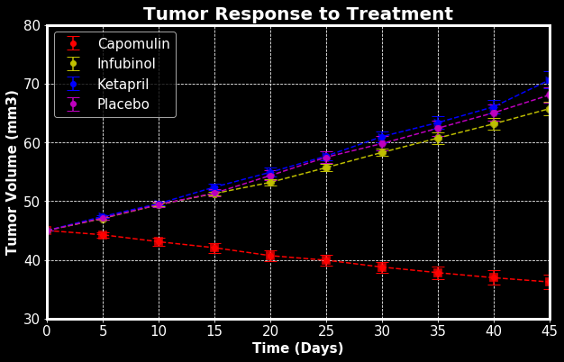
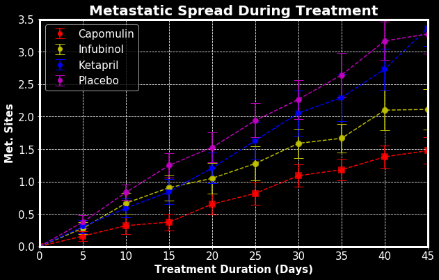
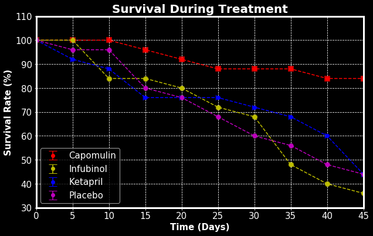
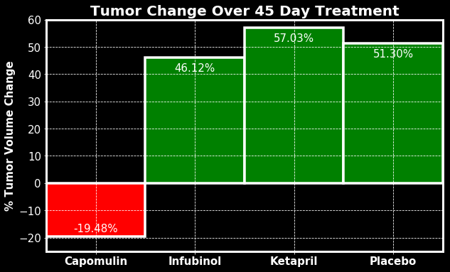

# Pymaceuticals Inc.

Analysis

* OBSERVED TREND 1: 
* The Capomulin group was the only group that yielded a decrease in tumor volume(with a average change of -19.48% in tumor volume after 45 days). Both the Infubinol group and the Ketapril group had similar tumor volume changes(46.12% and 57.03%, respectively) with the Placebo group(51.30%), after 45 days of drug use. A steady decrease in tumor volume was observed in the Capomulin group, compared with a steady increase in all other groups including the Placebo group.
* OBSERVED TREND 2:
* The largest amount of survival occurred in the Capomulin group(84%).
* OBSERVED TREND 3: 
* During the 45 day experiment, more metastatic sites were observed in the Placebo group than all other groups. The Capomulin group had the least amount of metastatic sites.


```python
# Dependencies
%matplotlib inline
import matplotlib
import matplotlib.pyplot as plt
import pandas as pd
import numpy as np
from scipy.stats import sem

# Using pandas to read csv files in data frame formats
clinical_trial = pd.read_csv("raw_data/clinicaltrial_data.csv")
mouse_drug = pd.read_csv("raw_data/mouse_drug_data.csv")

# merge dataframes into one
df = pd.merge(left=clinical_trial, right=mouse_drug, on="Mouse ID", how="outer")
df.head()
```


<div>
<style scoped>
    .dataframe tbody tr th:only-of-type {
        vertical-align: middle;
    }

    .dataframe tbody tr th {
        vertical-align: top;
    }

    .dataframe thead th {
        text-align: right;
    }
</style>
<table border="1" class="dataframe">
  <thead>
    <tr style="text-align: right;">
      <th></th>
      <th>Mouse ID</th>
      <th>Timepoint</th>
      <th>Tumor Volume (mm3)</th>
      <th>Metastatic Sites</th>
      <th>Drug</th>
    </tr>
  </thead>
  <tbody>
    <tr>
      <th>0</th>
      <td>b128</td>
      <td>0</td>
      <td>45.000000</td>
      <td>0</td>
      <td>Capomulin</td>
    </tr>
    <tr>
      <th>1</th>
      <td>b128</td>
      <td>5</td>
      <td>45.651331</td>
      <td>0</td>
      <td>Capomulin</td>
    </tr>
    <tr>
      <th>2</th>
      <td>b128</td>
      <td>10</td>
      <td>43.270852</td>
      <td>0</td>
      <td>Capomulin</td>
    </tr>
    <tr>
      <th>3</th>
      <td>b128</td>
      <td>15</td>
      <td>43.784893</td>
      <td>0</td>
      <td>Capomulin</td>
    </tr>
    <tr>
      <th>4</th>
      <td>b128</td>
      <td>20</td>
      <td>42.731552</td>
      <td>0</td>
      <td>Capomulin</td>
    </tr>
  </tbody>
</table>
</div>


# Tumor Response to Treatment


```python
# Groupby dataframe
drug_time_group = df.groupby(["Drug", "Timepoint"])
tumor_response = drug_time_group["Tumor Volume (mm3)"].mean().to_frame()
tumor_response
```


<div>
<style scoped>
    .dataframe tbody tr th:only-of-type {
        vertical-align: middle;
    }

    .dataframe tbody tr th {
        vertical-align: top;
    }

    .dataframe thead th {
        text-align: right;
    }
</style>
<table border="1" class="dataframe">
  <thead>
    <tr style="text-align: right;">
      <th></th>
      <th></th>
      <th>Tumor Volume (mm3)</th>
    </tr>
    <tr>
      <th>Drug</th>
      <th>Timepoint</th>
      <th></th>
    </tr>
  </thead>
  <tbody>
    <tr>
      <th rowspan="10" valign="top">Capomulin</th>
      <th>0</th>
      <td>45.000000</td>
    </tr>
    <tr>
      <th>5</th>
      <td>44.266086</td>
    </tr>
    <tr>
      <th>10</th>
      <td>43.084291</td>
    </tr>
    <tr>
      <th>15</th>
      <td>42.064317</td>
    </tr>
    <tr>
      <th>20</th>
      <td>40.716325</td>
    </tr>
    <tr>
      <th>25</th>
      <td>39.939528</td>
    </tr>
    <tr>
      <th>30</th>
      <td>38.769339</td>
    </tr>
    <tr>
      <th>35</th>
      <td>37.816839</td>
    </tr>
    <tr>
      <th>40</th>
      <td>36.958001</td>
    </tr>
    <tr>
      <th>45</th>
      <td>36.236114</td>
    </tr>
    <tr>
      <th rowspan="10" valign="top">Ceftamin</th>
      <th>0</th>
      <td>45.000000</td>
    </tr>
    <tr>
      <th>5</th>
      <td>46.503051</td>
    </tr>
    <tr>
      <th>10</th>
      <td>48.285125</td>
    </tr>
    <tr>
      <th>15</th>
      <td>50.094055</td>
    </tr>
    <tr>
      <th>20</th>
      <td>52.157049</td>
    </tr>
    <tr>
      <th>25</th>
      <td>54.287674</td>
    </tr>
    <tr>
      <th>30</th>
      <td>56.769517</td>
    </tr>
    <tr>
      <th>35</th>
      <td>58.827548</td>
    </tr>
    <tr>
      <th>40</th>
      <td>61.467895</td>
    </tr>
    <tr>
      <th>45</th>
      <td>64.132421</td>
    </tr>
    <tr>
      <th rowspan="10" valign="top">Infubinol</th>
      <th>0</th>
      <td>45.000000</td>
    </tr>
    <tr>
      <th>5</th>
      <td>47.062001</td>
    </tr>
    <tr>
      <th>10</th>
      <td>49.403909</td>
    </tr>
    <tr>
      <th>15</th>
      <td>51.296397</td>
    </tr>
    <tr>
      <th>20</th>
      <td>53.197691</td>
    </tr>
    <tr>
      <th>25</th>
      <td>55.715252</td>
    </tr>
    <tr>
      <th>30</th>
      <td>58.299397</td>
    </tr>
    <tr>
      <th>35</th>
      <td>60.742461</td>
    </tr>
    <tr>
      <th>40</th>
      <td>63.162824</td>
    </tr>
    <tr>
      <th>45</th>
      <td>65.755562</td>
    </tr>
    <tr>
      <th>...</th>
      <th>...</th>
      <td>...</td>
    </tr>
    <tr>
      <th rowspan="10" valign="top">Ramicane</th>
      <th>0</th>
      <td>45.000000</td>
    </tr>
    <tr>
      <th>5</th>
      <td>43.944859</td>
    </tr>
    <tr>
      <th>10</th>
      <td>42.531957</td>
    </tr>
    <tr>
      <th>15</th>
      <td>41.495061</td>
    </tr>
    <tr>
      <th>20</th>
      <td>40.238325</td>
    </tr>
    <tr>
      <th>25</th>
      <td>38.974300</td>
    </tr>
    <tr>
      <th>30</th>
      <td>38.703137</td>
    </tr>
    <tr>
      <th>35</th>
      <td>37.451996</td>
    </tr>
    <tr>
      <th>40</th>
      <td>36.574081</td>
    </tr>
    <tr>
      <th>45</th>
      <td>34.955595</td>
    </tr>
    <tr>
      <th rowspan="10" valign="top">Stelasyn</th>
      <th>0</th>
      <td>45.000000</td>
    </tr>
    <tr>
      <th>5</th>
      <td>47.527452</td>
    </tr>
    <tr>
      <th>10</th>
      <td>49.463844</td>
    </tr>
    <tr>
      <th>15</th>
      <td>51.529409</td>
    </tr>
    <tr>
      <th>20</th>
      <td>54.067395</td>
    </tr>
    <tr>
      <th>25</th>
      <td>56.166123</td>
    </tr>
    <tr>
      <th>30</th>
      <td>59.826738</td>
    </tr>
    <tr>
      <th>35</th>
      <td>62.440699</td>
    </tr>
    <tr>
      <th>40</th>
      <td>65.356386</td>
    </tr>
    <tr>
      <th>45</th>
      <td>68.438310</td>
    </tr>
    <tr>
      <th rowspan="10" valign="top">Zoniferol</th>
      <th>0</th>
      <td>45.000000</td>
    </tr>
    <tr>
      <th>5</th>
      <td>46.851818</td>
    </tr>
    <tr>
      <th>10</th>
      <td>48.689881</td>
    </tr>
    <tr>
      <th>15</th>
      <td>50.779059</td>
    </tr>
    <tr>
      <th>20</th>
      <td>53.170334</td>
    </tr>
    <tr>
      <th>25</th>
      <td>55.432935</td>
    </tr>
    <tr>
      <th>30</th>
      <td>57.713531</td>
    </tr>
    <tr>
      <th>35</th>
      <td>60.089372</td>
    </tr>
    <tr>
      <th>40</th>
      <td>62.916692</td>
    </tr>
    <tr>
      <th>45</th>
      <td>65.960888</td>
    </tr>
  </tbody>
</table>
<p>100 rows × 1 columns</p>
</div>


```python
# Pivot dataframe so that each drug is in one column
tumor_response = tumor_response.reset_index().pivot("Timepoint", "Drug", "Tumor Volume (mm3)")
tumor_response = tumor_response[["Capomulin", "Infubinol", "Ketapril", "Placebo"]]
tumor_response.head()
```


<div>
<style scoped>
    .dataframe tbody tr th:only-of-type {
        vertical-align: middle;
    }

    .dataframe tbody tr th {
        vertical-align: top;
    }

    .dataframe thead th {
        text-align: right;
    }
</style>
<table border="1" class="dataframe">
  <thead>
    <tr style="text-align: right;">
      <th>Drug</th>
      <th>Capomulin</th>
      <th>Infubinol</th>
      <th>Ketapril</th>
      <th>Placebo</th>
    </tr>
    <tr>
      <th>Timepoint</th>
      <th></th>
      <th></th>
      <th></th>
      <th></th>
    </tr>
  </thead>
  <tbody>
    <tr>
      <th>0</th>
      <td>45.000000</td>
      <td>45.000000</td>
      <td>45.000000</td>
      <td>45.000000</td>
    </tr>
    <tr>
      <th>5</th>
      <td>44.266086</td>
      <td>47.062001</td>
      <td>47.389175</td>
      <td>47.125589</td>
    </tr>
    <tr>
      <th>10</th>
      <td>43.084291</td>
      <td>49.403909</td>
      <td>49.582269</td>
      <td>49.423329</td>
    </tr>
    <tr>
      <th>15</th>
      <td>42.064317</td>
      <td>51.296397</td>
      <td>52.399974</td>
      <td>51.359742</td>
    </tr>
    <tr>
      <th>20</th>
      <td>40.716325</td>
      <td>53.197691</td>
      <td>54.920935</td>
      <td>54.364417</td>
    </tr>
  </tbody>
</table>
</div>


```python
# Set linewidth of borders
matplotlib.rcParams["axes.linewidth"] = 3
```


```python
# Reset indext so that "Timepoints" is in one column
tumor_response = tumor_response.reset_index()

# Calculate sem
errors = drug_time_group.sem()
errors = errors.reset_index().pivot("Timepoint", "Drug", "Tumor Volume (mm3)")
errors = errors[["Capomulin", "Infubinol", "Ketapril", "Placebo"]].reset_index()

# Set background and font size
plt.style.use("dark_background")
matplotlib.rcParams.update({"font.size": 15})

# Plot a scatter plot
y = ["Capomulin", "Infubinol", "Ketapril", "Placebo"]
color = ["r", "y", "b", "m"]
ax = tumor_response.plot(kind="scatter", x="Timepoint", y=y[0], legend=False, alpha=.8, edgecolor="k", marker="s", s=100, linewidth=0.3, color=color[0], label=y[0], figsize=(10,6));
tumor_response.plot(kind="scatter", x="Timepoint", y=y[1], legend=False, alpha=.8, edgecolor="k", marker="8", s=100, linewidth=0.3, color=color[1], label=y[1], ax=ax);
tumor_response.plot(kind="scatter", x="Timepoint", y=y[2], legend=False, alpha=.8, edgecolor="k", marker=">", s=100, linewidth=0.3, color=color[2], label=y[2], ax=ax);
tumor_response.plot(kind="scatter", x="Timepoint", y=y[3], legend=False, alpha=.8, edgecolor="k", marker="H", s=100, linewidth=0.3, color=color[3], label=y[3], ax=ax)

# Plot error bars
for i in range(4):
    ax.errorbar(tumor_response["Timepoint"], tumor_response[y[i]], yerr=errors[y[i]], fmt="o", capsize=7, color=color[i], data=errors)

# Set styles
plt.legend()
plt.grid()
plt.xlim(0, 45)
plt.ylim(30, 80)
plt.title("Tumor Response to Treatment", fontsize=20, fontweight="bold")
ax.set_xlabel("Time (Days)", weight="bold")
plt.ylabel("Tumor Volume (mm3)", weight="bold")
plt.grid(ls="--")

# Plot dashed lines
for i in range(4):
    plt.plot(tumor_response["Timepoint"], tumor_response[y[i]], color[i]+"--")
plt.show()
```





# Metastatic Response to Treatment


```python
# Groupby dataframe
drug_time_group = df.groupby(["Drug", "Timepoint"])
metastatic_response = drug_time_group["Metastatic Sites"].mean().to_frame()
metastatic_response
```


<div>
<style scoped>
    .dataframe tbody tr th:only-of-type {
        vertical-align: middle;
    }

    .dataframe tbody tr th {
        vertical-align: top;
    }

    .dataframe thead th {
        text-align: right;
    }
</style>
<table border="1" class="dataframe">
  <thead>
    <tr style="text-align: right;">
      <th></th>
      <th></th>
      <th>Metastatic Sites</th>
    </tr>
    <tr>
      <th>Drug</th>
      <th>Timepoint</th>
      <th></th>
    </tr>
  </thead>
  <tbody>
    <tr>
      <th rowspan="10" valign="top">Capomulin</th>
      <th>0</th>
      <td>0.000000</td>
    </tr>
    <tr>
      <th>5</th>
      <td>0.160000</td>
    </tr>
    <tr>
      <th>10</th>
      <td>0.320000</td>
    </tr>
    <tr>
      <th>15</th>
      <td>0.375000</td>
    </tr>
    <tr>
      <th>20</th>
      <td>0.652174</td>
    </tr>
    <tr>
      <th>25</th>
      <td>0.818182</td>
    </tr>
    <tr>
      <th>30</th>
      <td>1.090909</td>
    </tr>
    <tr>
      <th>35</th>
      <td>1.181818</td>
    </tr>
    <tr>
      <th>40</th>
      <td>1.380952</td>
    </tr>
    <tr>
      <th>45</th>
      <td>1.476190</td>
    </tr>
    <tr>
      <th rowspan="10" valign="top">Ceftamin</th>
      <th>0</th>
      <td>0.000000</td>
    </tr>
    <tr>
      <th>5</th>
      <td>0.380952</td>
    </tr>
    <tr>
      <th>10</th>
      <td>0.600000</td>
    </tr>
    <tr>
      <th>15</th>
      <td>0.789474</td>
    </tr>
    <tr>
      <th>20</th>
      <td>1.111111</td>
    </tr>
    <tr>
      <th>25</th>
      <td>1.500000</td>
    </tr>
    <tr>
      <th>30</th>
      <td>1.937500</td>
    </tr>
    <tr>
      <th>35</th>
      <td>2.071429</td>
    </tr>
    <tr>
      <th>40</th>
      <td>2.357143</td>
    </tr>
    <tr>
      <th>45</th>
      <td>2.692308</td>
    </tr>
    <tr>
      <th rowspan="10" valign="top">Infubinol</th>
      <th>0</th>
      <td>0.000000</td>
    </tr>
    <tr>
      <th>5</th>
      <td>0.280000</td>
    </tr>
    <tr>
      <th>10</th>
      <td>0.666667</td>
    </tr>
    <tr>
      <th>15</th>
      <td>0.904762</td>
    </tr>
    <tr>
      <th>20</th>
      <td>1.050000</td>
    </tr>
    <tr>
      <th>25</th>
      <td>1.277778</td>
    </tr>
    <tr>
      <th>30</th>
      <td>1.588235</td>
    </tr>
    <tr>
      <th>35</th>
      <td>1.666667</td>
    </tr>
    <tr>
      <th>40</th>
      <td>2.100000</td>
    </tr>
    <tr>
      <th>45</th>
      <td>2.111111</td>
    </tr>
    <tr>
      <th>...</th>
      <th>...</th>
      <td>...</td>
    </tr>
    <tr>
      <th rowspan="10" valign="top">Ramicane</th>
      <th>0</th>
      <td>0.000000</td>
    </tr>
    <tr>
      <th>5</th>
      <td>0.120000</td>
    </tr>
    <tr>
      <th>10</th>
      <td>0.250000</td>
    </tr>
    <tr>
      <th>15</th>
      <td>0.333333</td>
    </tr>
    <tr>
      <th>20</th>
      <td>0.347826</td>
    </tr>
    <tr>
      <th>25</th>
      <td>0.652174</td>
    </tr>
    <tr>
      <th>30</th>
      <td>0.782609</td>
    </tr>
    <tr>
      <th>35</th>
      <td>0.952381</td>
    </tr>
    <tr>
      <th>40</th>
      <td>1.100000</td>
    </tr>
    <tr>
      <th>45</th>
      <td>1.250000</td>
    </tr>
    <tr>
      <th rowspan="10" valign="top">Stelasyn</th>
      <th>0</th>
      <td>0.000000</td>
    </tr>
    <tr>
      <th>5</th>
      <td>0.240000</td>
    </tr>
    <tr>
      <th>10</th>
      <td>0.478261</td>
    </tr>
    <tr>
      <th>15</th>
      <td>0.782609</td>
    </tr>
    <tr>
      <th>20</th>
      <td>0.952381</td>
    </tr>
    <tr>
      <th>25</th>
      <td>1.157895</td>
    </tr>
    <tr>
      <th>30</th>
      <td>1.388889</td>
    </tr>
    <tr>
      <th>35</th>
      <td>1.562500</td>
    </tr>
    <tr>
      <th>40</th>
      <td>1.583333</td>
    </tr>
    <tr>
      <th>45</th>
      <td>1.727273</td>
    </tr>
    <tr>
      <th rowspan="10" valign="top">Zoniferol</th>
      <th>0</th>
      <td>0.000000</td>
    </tr>
    <tr>
      <th>5</th>
      <td>0.166667</td>
    </tr>
    <tr>
      <th>10</th>
      <td>0.500000</td>
    </tr>
    <tr>
      <th>15</th>
      <td>0.809524</td>
    </tr>
    <tr>
      <th>20</th>
      <td>1.294118</td>
    </tr>
    <tr>
      <th>25</th>
      <td>1.687500</td>
    </tr>
    <tr>
      <th>30</th>
      <td>1.933333</td>
    </tr>
    <tr>
      <th>35</th>
      <td>2.285714</td>
    </tr>
    <tr>
      <th>40</th>
      <td>2.785714</td>
    </tr>
    <tr>
      <th>45</th>
      <td>3.071429</td>
    </tr>
  </tbody>
</table>
<p>100 rows × 1 columns</p>
</div>


```python
# Pivot dataframe so that each drug is in one column
metastatic_response = metastatic_response.reset_index().pivot("Timepoint", "Drug", "Metastatic Sites")
metastatic_response = metastatic_response[["Capomulin", "Infubinol", "Ketapril", "Placebo"]]
metastatic_response.head()
```


<div>
<style scoped>
    .dataframe tbody tr th:only-of-type {
        vertical-align: middle;
    }

    .dataframe tbody tr th {
        vertical-align: top;
    }

    .dataframe thead th {
        text-align: right;
    }
</style>
<table border="1" class="dataframe">
  <thead>
    <tr style="text-align: right;">
      <th>Drug</th>
      <th>Capomulin</th>
      <th>Infubinol</th>
      <th>Ketapril</th>
      <th>Placebo</th>
    </tr>
    <tr>
      <th>Timepoint</th>
      <th></th>
      <th></th>
      <th></th>
      <th></th>
    </tr>
  </thead>
  <tbody>
    <tr>
      <th>0</th>
      <td>0.000000</td>
      <td>0.000000</td>
      <td>0.000000</td>
      <td>0.000000</td>
    </tr>
    <tr>
      <th>5</th>
      <td>0.160000</td>
      <td>0.280000</td>
      <td>0.304348</td>
      <td>0.375000</td>
    </tr>
    <tr>
      <th>10</th>
      <td>0.320000</td>
      <td>0.666667</td>
      <td>0.590909</td>
      <td>0.833333</td>
    </tr>
    <tr>
      <th>15</th>
      <td>0.375000</td>
      <td>0.904762</td>
      <td>0.842105</td>
      <td>1.250000</td>
    </tr>
    <tr>
      <th>20</th>
      <td>0.652174</td>
      <td>1.050000</td>
      <td>1.210526</td>
      <td>1.526316</td>
    </tr>
  </tbody>
</table>
</div>


```python
# Reset indext so that "Timepoints" is in one column
metastatic_response = metastatic_response.reset_index()

# Calculate sem
errors = drug_time_group.sem()
errors = errors.reset_index().pivot("Timepoint", "Drug", "Metastatic Sites")
errors = errors[["Capomulin", "Infubinol", "Ketapril", "Placebo"]].reset_index()

# Set background and font size
plt.style.use("dark_background")
matplotlib.rcParams.update({"font.size": 15})

# Plot a scatter plot
y = ["Capomulin", "Infubinol", "Ketapril", "Placebo"]
color = ["r", "y", "b", "m"]
ax = metastatic_response.plot(kind="scatter", x="Timepoint", y=y[0], legend=False, alpha=.8, edgecolor="k", marker="s", s=100, linewidth=0.3, color=color[0], label=y[0], figsize=(10,6));
metastatic_response.plot(kind="scatter", x="Timepoint", y=y[1], legend=False, alpha=.8, edgecolor="k", marker="8", s=100, linewidth=0.3, color=color[1], label=y[1], ax=ax);
metastatic_response.plot(kind="scatter", x="Timepoint", y=y[2], legend=False, alpha=.8, edgecolor="k", marker=">", s=100, linewidth=0.3, color=color[2], label=y[2], ax=ax);
metastatic_response.plot(kind="scatter", x="Timepoint", y=y[3], legend=False, alpha=.8, edgecolor="k", marker="H", s=100, linewidth=0.3, color=color[3], label=y[3], ax=ax)

# Plot error bars
for i in range(4):
    ax.errorbar(metastatic_response["Timepoint"], metastatic_response[y[i]], yerr=errors[y[i]], fmt="o", capsize=7, color=color[i], data=errors)

# Set styles
plt.legend()
plt.grid()
plt.xlim(0, 45)
plt.ylim(0,3.5)
plt.title("Metastatic Spread During Treatment", fontsize=20, fontweight="bold")
ax.set_xlabel("Treatment Duration (Days)", weight="bold")
plt.ylabel("Met. Sites", weight="bold")
plt.grid(ls="--")

# Plot dashed lines
for i in range(4):
    plt.plot(metastatic_response["Timepoint"], metastatic_response[y[i]], color[i]+"--")
plt.show()
```





# Survival Rates


```python
# Groupby dataframe
drug_time_group = df.groupby(["Drug", "Timepoint"])
survival = drug_time_group["Mouse ID"].count().to_frame()
survival
```


<div>
<style scoped>
    .dataframe tbody tr th:only-of-type {
        vertical-align: middle;
    }

    .dataframe tbody tr th {
        vertical-align: top;
    }

    .dataframe thead th {
        text-align: right;
    }
</style>
<table border="1" class="dataframe">
  <thead>
    <tr style="text-align: right;">
      <th></th>
      <th></th>
      <th>Mouse ID</th>
    </tr>
    <tr>
      <th>Drug</th>
      <th>Timepoint</th>
      <th></th>
    </tr>
  </thead>
  <tbody>
    <tr>
      <th rowspan="10" valign="top">Capomulin</th>
      <th>0</th>
      <td>25</td>
    </tr>
    <tr>
      <th>5</th>
      <td>25</td>
    </tr>
    <tr>
      <th>10</th>
      <td>25</td>
    </tr>
    <tr>
      <th>15</th>
      <td>24</td>
    </tr>
    <tr>
      <th>20</th>
      <td>23</td>
    </tr>
    <tr>
      <th>25</th>
      <td>22</td>
    </tr>
    <tr>
      <th>30</th>
      <td>22</td>
    </tr>
    <tr>
      <th>35</th>
      <td>22</td>
    </tr>
    <tr>
      <th>40</th>
      <td>21</td>
    </tr>
    <tr>
      <th>45</th>
      <td>21</td>
    </tr>
    <tr>
      <th rowspan="10" valign="top">Ceftamin</th>
      <th>0</th>
      <td>25</td>
    </tr>
    <tr>
      <th>5</th>
      <td>21</td>
    </tr>
    <tr>
      <th>10</th>
      <td>20</td>
    </tr>
    <tr>
      <th>15</th>
      <td>19</td>
    </tr>
    <tr>
      <th>20</th>
      <td>18</td>
    </tr>
    <tr>
      <th>25</th>
      <td>18</td>
    </tr>
    <tr>
      <th>30</th>
      <td>16</td>
    </tr>
    <tr>
      <th>35</th>
      <td>14</td>
    </tr>
    <tr>
      <th>40</th>
      <td>14</td>
    </tr>
    <tr>
      <th>45</th>
      <td>13</td>
    </tr>
    <tr>
      <th rowspan="10" valign="top">Infubinol</th>
      <th>0</th>
      <td>25</td>
    </tr>
    <tr>
      <th>5</th>
      <td>25</td>
    </tr>
    <tr>
      <th>10</th>
      <td>21</td>
    </tr>
    <tr>
      <th>15</th>
      <td>21</td>
    </tr>
    <tr>
      <th>20</th>
      <td>20</td>
    </tr>
    <tr>
      <th>25</th>
      <td>18</td>
    </tr>
    <tr>
      <th>30</th>
      <td>17</td>
    </tr>
    <tr>
      <th>35</th>
      <td>12</td>
    </tr>
    <tr>
      <th>40</th>
      <td>10</td>
    </tr>
    <tr>
      <th>45</th>
      <td>9</td>
    </tr>
    <tr>
      <th>...</th>
      <th>...</th>
      <td>...</td>
    </tr>
    <tr>
      <th rowspan="10" valign="top">Ramicane</th>
      <th>0</th>
      <td>25</td>
    </tr>
    <tr>
      <th>5</th>
      <td>25</td>
    </tr>
    <tr>
      <th>10</th>
      <td>24</td>
    </tr>
    <tr>
      <th>15</th>
      <td>24</td>
    </tr>
    <tr>
      <th>20</th>
      <td>23</td>
    </tr>
    <tr>
      <th>25</th>
      <td>23</td>
    </tr>
    <tr>
      <th>30</th>
      <td>23</td>
    </tr>
    <tr>
      <th>35</th>
      <td>21</td>
    </tr>
    <tr>
      <th>40</th>
      <td>20</td>
    </tr>
    <tr>
      <th>45</th>
      <td>20</td>
    </tr>
    <tr>
      <th rowspan="10" valign="top">Stelasyn</th>
      <th>0</th>
      <td>26</td>
    </tr>
    <tr>
      <th>5</th>
      <td>25</td>
    </tr>
    <tr>
      <th>10</th>
      <td>23</td>
    </tr>
    <tr>
      <th>15</th>
      <td>23</td>
    </tr>
    <tr>
      <th>20</th>
      <td>21</td>
    </tr>
    <tr>
      <th>25</th>
      <td>19</td>
    </tr>
    <tr>
      <th>30</th>
      <td>18</td>
    </tr>
    <tr>
      <th>35</th>
      <td>16</td>
    </tr>
    <tr>
      <th>40</th>
      <td>12</td>
    </tr>
    <tr>
      <th>45</th>
      <td>11</td>
    </tr>
    <tr>
      <th rowspan="10" valign="top">Zoniferol</th>
      <th>0</th>
      <td>25</td>
    </tr>
    <tr>
      <th>5</th>
      <td>24</td>
    </tr>
    <tr>
      <th>10</th>
      <td>22</td>
    </tr>
    <tr>
      <th>15</th>
      <td>21</td>
    </tr>
    <tr>
      <th>20</th>
      <td>17</td>
    </tr>
    <tr>
      <th>25</th>
      <td>16</td>
    </tr>
    <tr>
      <th>30</th>
      <td>15</td>
    </tr>
    <tr>
      <th>35</th>
      <td>14</td>
    </tr>
    <tr>
      <th>40</th>
      <td>14</td>
    </tr>
    <tr>
      <th>45</th>
      <td>14</td>
    </tr>
  </tbody>
</table>
<p>100 rows × 1 columns</p>
</div>


```python
# Pivot dataframe so that each drug is in one column
survival = survival.reset_index().pivot("Timepoint", "Drug", "Mouse ID")
survival = survival[["Capomulin", "Infubinol", "Ketapril", "Placebo"]]
survival_rates = survival.divide(25).multiply(100)
survival_rates.head()
```


<div>
<style scoped>
    .dataframe tbody tr th:only-of-type {
        vertical-align: middle;
    }

    .dataframe tbody tr th {
        vertical-align: top;
    }

    .dataframe thead th {
        text-align: right;
    }
</style>
<table border="1" class="dataframe">
  <thead>
    <tr style="text-align: right;">
      <th>Drug</th>
      <th>Capomulin</th>
      <th>Infubinol</th>
      <th>Ketapril</th>
      <th>Placebo</th>
    </tr>
    <tr>
      <th>Timepoint</th>
      <th></th>
      <th></th>
      <th></th>
      <th></th>
    </tr>
  </thead>
  <tbody>
    <tr>
      <th>0</th>
      <td>100.0</td>
      <td>100.0</td>
      <td>100.0</td>
      <td>100.0</td>
    </tr>
    <tr>
      <th>5</th>
      <td>100.0</td>
      <td>100.0</td>
      <td>92.0</td>
      <td>96.0</td>
    </tr>
    <tr>
      <th>10</th>
      <td>100.0</td>
      <td>84.0</td>
      <td>88.0</td>
      <td>96.0</td>
    </tr>
    <tr>
      <th>15</th>
      <td>96.0</td>
      <td>84.0</td>
      <td>76.0</td>
      <td>80.0</td>
    </tr>
    <tr>
      <th>20</th>
      <td>92.0</td>
      <td>80.0</td>
      <td>76.0</td>
      <td>76.0</td>
    </tr>
  </tbody>
</table>
</div>


```python
# Reset indext so that "Timepoints" is in one column
survival_rates = survival_rates.reset_index()

# Calculate sem
errors = drug_time_group.sem()
errors = errors.reset_index().pivot("Timepoint", "Drug", "Mouse ID")
errors = errors[["Capomulin", "Infubinol", "Ketapril", "Placebo"]].reset_index()

# Set background and font size
plt.style.use("dark_background")
matplotlib.rcParams.update({"font.size": 15})

# Plot a scatter plot
y = ["Capomulin", "Infubinol", "Ketapril", "Placebo"]
color = ["r", "y", "b", "m"]
ax = survival_rates.plot(kind="scatter", x="Timepoint", y=y[0], legend=False, alpha=.8, edgecolor="k", marker="s", s=100, linewidth=0.3, color=color[0], label=y[0], figsize=(10,6));
survival_rates.plot(kind="scatter", x="Timepoint", y=y[1], legend=False, alpha=.8, edgecolor="k", marker="8", s=100, linewidth=0.3, color=color[1], label=y[1], ax=ax);
survival_rates.plot(kind="scatter", x="Timepoint", y=y[2], legend=False, alpha=.8, edgecolor="k", marker=">", s=100, linewidth=0.3, color=color[2], label=y[2], ax=ax);
survival_rates.plot(kind="scatter", x="Timepoint", y=y[3], legend=False, alpha=.8, edgecolor="k", marker="H", s=100, linewidth=0.3, color=color[3], label=y[3], ax=ax)

# Plot error bars
for i in range(4):
    ax.errorbar(survival_rates["Timepoint"], survival_rates[y[i]], yerr=errors[y[i]], fmt="o", capsize=7, color=color[i], data=errors)

# Set styles
plt.legend()
plt.grid()
plt.xlim(0, 45)
plt.ylim(30, 110)
plt.title("Survival During Treatment", fontsize=20, fontweight="bold")
plt.xlabel("Time (Days)", weight="bold")
plt.ylabel("Survival Rate (%)", weight="bold")
plt.grid(ls="--")

# Plot dashed lines
for i in range(4):
    plt.plot(survival_rates["Timepoint"], survival_rates[y[i]], color[i]+"--")
plt.show()
```





# Summary Bar Graph


```python
# Calculate changes of tumor volume
drugs = ["Capomulin", "Infubinol", "Ketapril", "Placebo"]
before = tumor_response.iloc[0, :]
after = tumor_response.iloc[-1,:]
change = (after-before)/before *100
change = change[drugs]
change
```


    Drug
    Capomulin   -19.475303
    Infubinol    46.123472
    Ketapril     57.028795
    Placebo      51.297960
    dtype: float64


```python
# Prepare parameters for bar plot
x = np.arange(0.5,4,1)
y = change.values.tolist()
color= ["red" if i<0 else "green" for i in change.values]

# Plot bar plot
fig, ax = plt.subplots()
change.plot(kind="bar", align="edge", width=1, edgecolor="w", linewidth=3.5, figsize=(10,6), grid=True, rot=0, color=color)

# Set style
plt.xlim(0, 4)
plt.ylim(-25, 60)
plt.title("Tumor Change Over 45 Day Treatment", fontsize=20, fontweight="bold")
plt.xlabel("")
plt.ylabel("% Tumor Volume Change", weight="bold")
plt.xticks(x, weight="bold")
plt.grid(ls="--")

# Add percentages as text in bars
for i in range(4):
    if y[i]>0:
        ax.text(x[i], y[i]-5, f"{y[i]:.2f}%", horizontalalignment="center")
    else:
        ax.text(x[i], y[i]+1.5, f"{y[i]:.2f}%", horizontalalignment="center")

plt.show()
```




